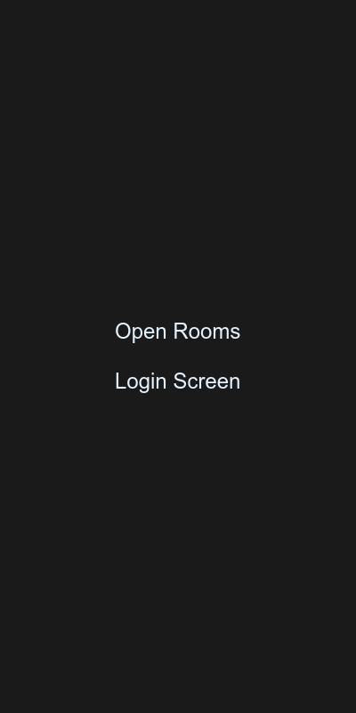
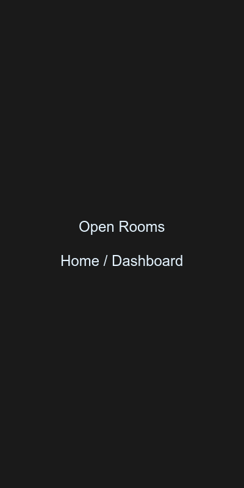
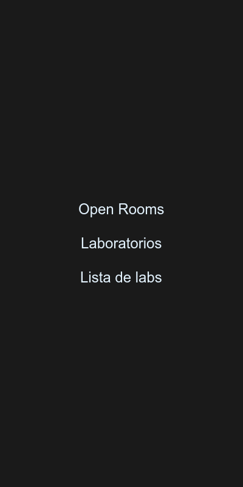
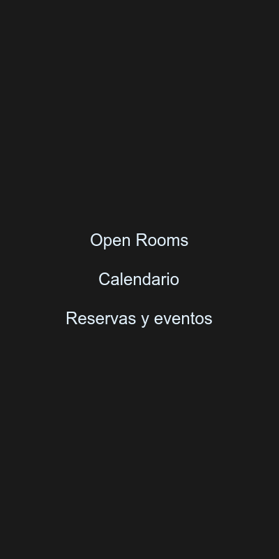
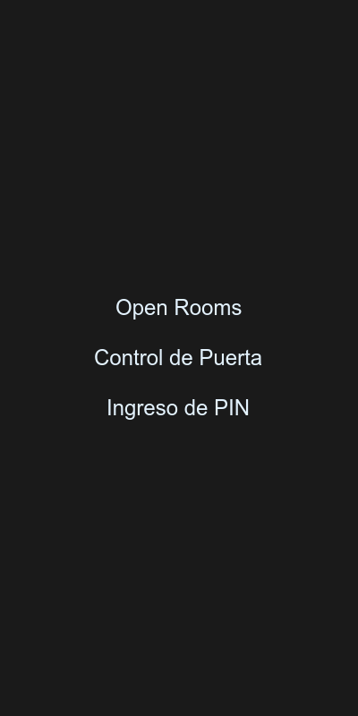
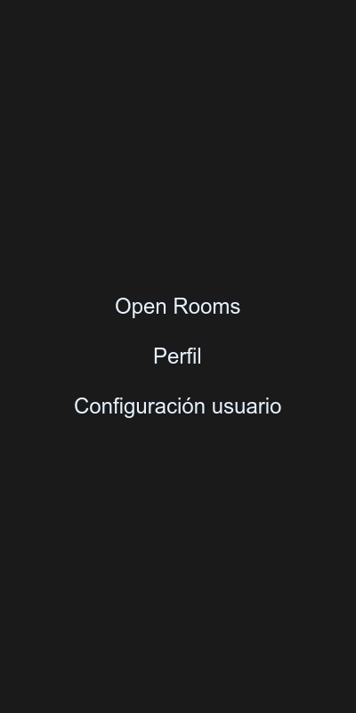

# Open Rooms

```markdown
#     #     #  #       #      #      #      #
#     #     #  #       #      #      # #
#######     #  #       #      #      #
#     #     #  #       #      #      # #
#     #     #  #######  ###### #      #      #
```

**Aplicación Flutter multiplataforma para gestión de espacios educativos y reservas**

---

[](https://flutter.dev)
[](https://dart.dev)
[](https://firebase.google.com)
[](LICENSE)
[](#)
[](pubspec.yaml)

---

## Índice

- [Descripción](#descripción)
- [Características](#características)
- [Capturas de Pantalla](#capturas-de-pantalla)
- [Prerrequisitos](#prerrequisitos)
- [Instalación](#instalación)
- [Configuración de Firebase](#configuración-de-firebase)
- [Estructura del Proyecto](#estructura-del-proyecto)
- [Stack Tecnológico](#stack-tecnológico)
- [Arquitectura](#arquitectura)
- [Funcionalidades Detalladas](#funcionalidades-detalladas)
- [Guía de Desarrollo](#guía-de-desarrollo)
- [Build para Producción](#build-para-producción)
- [Roadmap](#roadmap)
- [Contribuciones](#contribuciones)
- [Licencia y Contacto](#licencia-y-contacto)

---

## Descripción

**Open Rooms** es una aplicación móvil multiplataforma desarrollada con Flutter que permite gestionar el uso de espacios educativos o "laboratorios". Diseñada para instituciones educativas, facilita la organización de reservas, el control de acceso a salones mediante PIN, y el seguimiento de disponibilidad de espacios en tiempo real.

### Casos de Uso

- **Docentes**: Pueden reservar laboratorios para sus clases, definir horarios específicos y generar códigos PIN para acceder.
- **Estudiantes**: Verifican disponibilidad de laboratorios y pueden acceder mediante el PIN proporcionado por el docente.
- **Administradores**: Monitorean el estado de apertura/cierre de espacios en tiempo real.

---

## Características

### 🔐 Autenticación
- Login y logout de usuarios mediante correo electrónico y contraseña
- Estado de autenticación persistente (sesión mantenida tras cerrar la app)
- Integración con Firebase Authentication
- Manejo de errores de autenticación con mensajes claros

### 📅 Calendario Interactivo
- Visualización de reservas en formato semanal/mensual
- Navegación fluida entre fechas
- Creación de nuevas reservas con:
  - Título del evento
  - Asignatura
  - Horario de inicio y fin
  - PIN de acceso de 4 dígitos
- Indicadores visuales de días con eventos

### 🏢 Gestión de Laboratorios
- Listado de laboratorios disponibles en tiempo real
- Estado de ocupación actual (abierto/cerrado)
- Navegación directa al calendario de cada laboratorio
- Actualizaciones en tiempo real mediante Firebase Realtime Database

### 🚪 Control de Acceso
- Sistema de apertura/cierre de puertas mediante PIN
- Validación de PIN de 4 dígitos
- Detección automática de reservas activas del usuario
- Mensajes de estado claro ("No tienes una reservación")

### 👤 Perfil de Usuario
- Visualización de información del usuario actual
- Cierre de sesión seguro

### 🧭 Navegación
- Sistema de rutas declarativas con `go_router`
- Navegación fluida entre pantallas
- Protección de rutas según estado de autenticación

---

## Capturas de Pantalla

### Pantalla de Login

*Formulario de autenticación con campos de email y contraseña*

### Dashboard / Home

*Panel principal con acceso rápido a las funcionalidades principales*

### Lista de Laboratorios

*Grid de laboratorios disponibles con indicadores de estado*

### Calendario de Reservas

*Vista de calendario con eventos y posibilidad de crear nuevas reservas*

### Control de Puerta

*Interfaz de acceso mediante PIN para abrir/cerrar laboratorios*

### Perfil de Usuario

*Panel de perfil de usuario con opción de cerrar sesión*

---

## Prerrequisitos

### Requisitos de Software

| Herramienta | Versión Mínima | Descripción |
|-------------|----------------|-------------|
| **Flutter SDK** | 3.4.1 | Framework de desarrollo multiplataforma |
| **Dart SDK** | 3.4.1 | Lenguaje de programación |
| **Android Studio** | Última estable | IDE recomendado para desarrollo (opcional) |
| **VS Code** | Última estable | Editor alternativo (opcional) |
| **Firebase CLI** | Última estable | Herramienta de línea de comandos de Firebase |
| **Chrome** | Última estable | Para desarrollo web |

### Plataformas Soportadas

- **Android**: SDK 23 (Android 6.0) o superior
- **iOS**: iOS 12.0 o superior
- **Web**: Chrome, Firefox, Safari, Edge (versiones recientes)

### Requisitos de Firebase

- Cuenta de Google
- Proyecto de Firebase creado (o capacidad de crear uno)
- Habilitados: Authentication (Email/Password) y Realtime Database

---

## Instalación

### 1. Clonar el Repositorio

```bash
git clone https://github.com/tu-usuario/open_rooms.git
cd open_rooms
```

### 2. Instalar Dependencias

```bash
flutter pub get
```

### 3. Verificar Configuración de Flutter

```bash
flutter doctor
```

Asegúrate de que todos los checkmarks estén verdes. Si no, sigue las instrucciones sugeridas.

### 4. Configuración Inicial de Firebase

Antes de ejecutar la app, necesitas configurar Firebase. Ve a la sección [Configuración de Firebase](#configuración-de-firebase).

### 5. Ejecutar la Aplicación

#### En Chrome (Web - más rápido para desarrollo)
```bash
flutter run -d chrome
```

#### En Android
```bash
flutter run -d android
# O si hay múltiples dispositivos:
flutter devices
flutter run -d <device-id>
```

#### En iOS (Solo en macOS)
```bash
flutter run -d ios
```

#### En todas las plataformas disponibles
```bash
flutter run
```

---

## Configuración de Firebase

### Paso 1: Crear Proyecto en Firebase Console

1. Ve a [Firebase Console](https://console.firebase.google.com/)
2. Haz clic en "Agregar proyecto"
3. Nombra tu proyecto: `open-rooms`
4. Sigue los pasos de configuración (puedes desactivar Google Analytics para este proyecto)

### Paso 2: Habilitar Servicios

#### 2.1 Firebase Authentication
1. Navega a **Authentication** → **Comenzar**
2. Selecciona **Correo electrónico/contraseña**
3. Actívalo y guarda

#### 2.2 Realtime Database
1. Navega a **Realtime Database** → **Crear base de datos**
2. Selecciona ubicación (sugerido: us-central)
3. Elige "Empezar en modo de prueba" para desarrollo
4. Modifica las reglas de seguridad según tus necesidades:

```json
{
  "rules": {
    ".read": "auth != null",
    ".write": "auth != null"
  }
}
```

### Paso 3: Instalar FlutterFire CLI

```bash
dart pub global activate flutterfire_cli
```

Verifica la instalación:
```bash
flutterfire --version
```

### Paso 4: Configurar Firebase para el Proyecto

Desde la raíz del proyecto:

```bash
flutterfire configure --project=open-rooms
```

Este comando:
- Te pedirá que inicies sesión en Google
- Detectará tu proyecto `open-rooms`
- Preguntará qué plataformas deseas configurar (Android, iOS, Web)
- Generará el archivo `lib/firebase_options.dart`

### Paso 5: Configuración por Plataforma

#### Android

El archivo `google-services.json` se genera automáticamente al ejecutar `flutterfire configure`. Verifica que esté en:
```
android/app/google-services.json
```

Si necesitas hacerlo manualmente:
1. En Firebase Console → Project Settings → Apps → Android
2. Descarga `google-services.json`
3. Colócalo en `android/app/`

Verifica que `android/app/build.gradle` incluye:
```gradle
apply plugin: 'com.google.gms.google-services'
```

#### iOS

El archivo `GoogleService-Info.plist` se genera automáticamente. Verifica que esté en:
```
ios/Runner/GoogleService-Info.plist
```

Si necesitas hacerlo manualmente:
1. En Firebase Console → Project Settings → Apps → iOS
2. Descarga `GoogleService-Info.plist`
3. Añádelo al proyecto Xcode en la carpeta Runner

#### Web

La configuración web se genera automáticamente en `firebase_options.dart`.

### Paso 6: Estructura de la Base de Datos

La aplicación espera la siguiente estructura en Firebase Realtime Database:

```
open-rooms/
└── labs/
    ├── {labId}/
    │   ├── title: "Lab Name"
    │   ├── open: boolean
    │   └── reservations/
    │       └── {reservationId}/
    │           ├── day: int (1-31)
    │           ├── month: int (1-12)
    │           ├── year: int (ej. 2024)
    │           ├── start_hour: int (0-23)
    │           ├── start_minute: int (0-59)
    │           ├── end_hour: int (0-23)
    │           ├── end_minute: int (0-59)
    │           ├── title: string
    │           ├── subject: string
    │           ├── teacher_uid: string
    │           └── pin: string (4 dígitos)
```

### Ejemplo de Datos Iniciales

Puedes crear laboratorios iniciales desde Firebase Console:

```json
{
  "labs": {
    "lab1": {
      "title": "Laboratorio de Computación",
      "open": false,
      "reservations": {}
    },
    "lab2": {
      "title": "Laboratorio de Física",
      "open": false,
      "reservations": {}
    }
  }
}
```

---

## Estructura del Proyecto

```
open_rooms/
├── android/                          # Configuración nativa Android
│   ├── app/
│   │   ├── google-services.json      # Configuración Firebase Android
│   │   └── build.gradle
│   └── ...
├── ios/                              # Configuración nativa iOS
│   ├── Runner/
│   │   └── GoogleService-Info.plist  # Configuración Firebase iOS
│   └── ...
├── web/                              # Configuración Web
│   └── index.html
├── lib/                              # Código fuente Dart
│   ├── main.dart                     # Punto de entrada
│   ├── firebase_options.dart         # Configuración de Firebase
│   └── project/
│       ├── classes/                  # Modelos de datos
│       │   ├── calendar_data.dart    # Datos del calendario
│       │   ├── date_day.dart         # Representación de fecha
│       │   ├── event.dart            # Modelo de evento/reserva
│       │   └── events.dart           # Colección de eventos
│       ├── methods/                  # Lógica de negocio
│       │   ├── method_login.dart     # Autenticación de usuarios
│       │   └── method_logout.dart    # Cierre de sesión
│       ├── pages/                    # Pantallas (Screens)
│       │   ├── calendar.dart         # Calendario y reservas
│       │   ├── door.dart             # Control de acceso
│       │   ├── error.dart            # Manejo de errores
│       │   ├── home.dart             # Dashboard principal
│       │   ├── labs.dart             # Lista de laboratorios
│       │   ├── login.dart            # Inicio de sesión
│       │   └── profile.dart          # Perfil de usuario
│       ├── routes/                   # Navegación
│       │   ├── app_route_config.dart # Configuración de rutas
│       │   └── app_route_constants.dart # Constantes de rutas
│       ├── utils.dart                # Utilidades compartidas
│       └── widgets/                  # Componentes reutilizables
│           ├── custom_button.dart    # Botón personalizado
│           ├── custom_text_field.dart # Campo de texto personalizado
│           └── panel_item.dart      # Item de panel grid
├── test/                             # Pruebas unitarias y widget
│   └── widget_test.dart
├── screenshots/                      # Capturas de pantalla
├── pubspec.yaml                      # Dependencias del proyecto
├── analysis_options.yaml             # Configuración de análisis
├── firebase.json                     # Configuración Firebase Hosting
└── README.md                         # Este archivo
```

---

## Stack Tecnológico

| Tecnología | Versión | Uso |
|------------|---------|-----|
| **Flutter** | 3.4.1+ | Framework de desarrollo multiplataforma |
| **Dart** | 3.4.1+ | Lenguaje de programación |
| **Firebase Core** | 3.1.0 | SDK base de Firebase |
| **Firebase Auth** | 5.1.0 | Autenticación de usuarios |
| **Firebase Realtime Database** | 11.0.2 | Base de datos en tiempo real |
| **go_router** | 14.2.0 | Gestión de rutas declarativa |
| **table_calendar** | 3.1.2 | Widget de calendario interactivo |
| **pinput** | 5.0.0 | Input de PIN de 4 dígitos |
| **loading_btn** | 1.0.3 | Botón con estado de carga |
| **intl** | 0.19.0 | Formateo de fechas y números |
| **cupertino_icons** | 1.0.6 | Iconos estilo iOS |

---

## Arquitectura

### Patrón de Arquitectura

La aplicación sigue una arquitectura simple basada en **Widgets con Estado** y separación de **Vista/Modelo**:

```
┌─────────────────────────────────────────────────┐
│                   Páginas                       │
│  (Pages)                                        │
│  - login.dart                                   │
│  - home.dart                                    │
│  - calendar.dart                                │
│  - door.dart                                    │
│  - labs.dart                                    │
│  - profile.dart                                 │
└──────────────────┬──────────────────────────────┘
                   │
                   │ usa
                   │
┌──────────────────▼──────────────────────────────┐
│                 Componentes                      │
│  (Widgets Reutilizables)                         │
│  - CustomButton                                  │
│  - CustomTextField                               │
│  - PanelItem                                     │
└──────────────────┬──────────────────────────────┘
                   │
                   │ usa
                   │
┌──────────────────▼──────────────────────────────┐
│                 Modelos                          │
│  (Classes)                                       │
│  - Event                                         │
│  - DateDay                                       │
│  - Events                                        │
└──────────────────┬──────────────────────────────┘
                   │
                   │ usa
                   │
┌──────────────────▼──────────────────────────────┐
│                 Servicios                        │
│  (Methods + Firebase)                            │
│  - methodLogin()                                 │
│  - methodLogout()                                │
│  - FirebaseDatabase.ref()                        │
└─────────────────────────────────────────────────┘
```

### Flujo de Datos

1. **Usuario interactúa** con una página (Widget)
2. **Widget actualiza su estado** (setState) basado en eventos
3. **Llamadas a Firebase** para leer/escribir datos en tiempo real
4. **Firebase Streams** notifican cambios automáticamente
5. **UI se reconstruye** con los nuevos datos

---

## Funcionalidades Detalladas

### Autenticación

**Archivo**: `lib/project/methods/method_login.dart`

- Valida credenciales mediante Firebase Auth
- Maneja errores:
  - Usuario no encontrado
  - Contraseña incorrecta
  - Usuario deshabilitado
  - Red unavailable
- Sesión persistente: el usuario permanece autenticado tras cerrar la app

**Archivo**: `lib/project/methods/method_logout.dart`

- Cierra la sesión del usuario
- Redirige a la pantalla de login

### Calendario

**Archivo**: `lib/project/pages/calendar.dart`

- Usa el paquete `table_calendar` para renderizar el calendario
- Formatos disponibles: mes, semana, dos semanas
- Eventos marcados con puntos blancos
- Dialog modal para crear nuevas reservas con:
  - Campo de título
  - Campo de asignatura
  - Campo PIN (4 dígitos)
  - Selectores de hora de inicio y fin
- Los eventos se guardan en Firebase Realtime Database

### Gestión de Laboratorios

**Archivo**: `lib/project/pages/labs.dart`

- Escucha cambios en la colección `labs` en tiempo real
- Renderiza un grid con cards de laboratorios
- Cada card muestra:
  - Nombre del laboratorio
  - Icono de habitación
  - Navegación al calendario específico

### Control de Puerta

**Archivo**: `lib/project/pages/door.dart`

- Detecta automáticamente si el usuario tiene una reserva activa
- Muestra:
  - Información de la reserva actual (título, horario)
  - Campo de PIN de 4 dígitos
  - Botón "Abrir puerta" o "Cerrar puerta"
- Si no hay reserva activa:
  - Muestra mensaje "No tienes una reservación"
  - Botón para ir a reservar

### Perfil

**Archivo**: `lib/project/pages/profile.dart`

- Muestra UID del usuario actual
- Botón de cierre de sesión

---

## Guía de Desarrollo

### Comandos Útiles

```bash
# Obtener dependencias
flutter pub get

# Actualizar dependencias
flutter pub upgrade

# Ver dependencias desactualizadas
flutter pub outdated

# Ejecutar la app
flutter run

# Ejecutar en dispositivo específico
flutter devices              # Listar dispositivos disponibles
flutter run -d chrome        # Chrome
flutter run -d android       # Android
flutter run -d ios           # iOS (solo macOS)

# Ejecutar en modo release (para pruebas de rendimiento)
flutter run --release

# Ejecutar tests
flutter test

# Análisis estático de código
flutter analyze

# Formatear código
flutter format .

# Limpiar archivos generados
flutter clean
```

### Debugging

```bash
# Ver logs en consola
flutter logs

# Debug con breakpoints (usa VS Code o Android Studio)

# Inspeccionar widget tree
# En VS Code: Command Palette → "Flutter: Inspect Widget"
```

### Testing

El proyecto incluye pruebas básicas en `test/widget_test.dart`. Para ejecutar:

```bash
flutter test
```

Para cubrir el código con tests:
```bash
flutter test --coverage
```

---

## Build para Producción

### Android

#### APK (Para distribución directa)
```bash
flutter build apk --release
# Output: build/app/outputs/flutter-apk/app-release.apk
```

#### App Bundle (Para Play Store)
```bash
flutter build appbundle --release
# Output: build/app/outputs/bundle/release/app-release.aab
```

#### Configurar nombre de la app
Edita `android/app/src/main/AndroidManifest.xml`:
```xml
<application
    android:label="Open Rooms"
    ...>
```

### iOS

#### Build para App Store
```bash
flutter build ios --release
```

Luego abre el proyecto en Xcode:
```bash
open ios/Runner.xcworkspace
```

Y sigue el proceso normal de Archivo → Distribución.

### Web

#### Build para hosting
```bash
flutter build web --release
# Output: build/web/
```

#### Desplegar en Firebase Hosting
```bash
# Primero instala Firebase CLI si no lo tienes
npm install -g firebase-tools

# Inicia sesión
firebase login

# Inicializa el proyecto (solo la primera vez)
firebase init

# Despliega
firebase deploy
```

### Generación de Iconos

Para generar iconos para todas las plataformas, usa:
```bash
flutter pub run flutter_launcher_icons
```

---

## Roadmap

### Versión 1.1 (Planeado)
- [ ] Notificaciones push para recordatorios de reservas
- [ ] Historial de reservas del usuario
- [ ] Editar y cancelar reservas existentes
- [ ] Exportar calendario a .ics

### Versión 1.2 (Planeado)
- [ ] Autenticación con Google
- [ ] Perfiles administradores para gestión de laboratorios
- [ ] Reportes de uso de espacios
- [ ] Búsqueda de laboratorios

### Versión 2.0 (Futuro)
- [ ] Modo offline con sincronización automática
- [ ] Integración con calendarios externos (Google Calendar)
- [ ] Dark/Light mode con persistencia
- [ ] Soporte multi-idioma

---

## Contribuciones

### Cómo Contribuir

1. **Fork** el repositorio
2. Crea una rama para tu feature (`git checkout -b feature/AmazingFeature`)
3. Commit tus cambios (`git commit -m 'Add some AmazingFeature'`)
4. Push a la rama (`git push origin feature/AmazingFeature`)
5. Abre un **Pull Request**

### Guía de Estilo

- Sigue las [Dart Style Guidelines](https://dart.dev/guides/language/effective-dart/style)
- Usa `flutter format .` antes de commitear
- Ejecuta `flutter analyze` y corrige los warnings
- Escribe tests para nuevas funcionalidades
- Documenta código complejo con comentarios

### Reportar Issues

Si encuentras un bug o tienes una sugerencia:

1. Busca si ya existe un issue similar
2. Crea un nuevo issue con:
   - Título descriptivo
   - Pasos para reproducir (si es un bug)
   - Comportamiento esperado vs actual
   - Screenshots si aplica
   - Versión de Flutter y Dart
   - Plataforma donde ocurre

---

## Licencia y Contacto

### Licencia

Este proyecto se encuentra bajo la licencia MIT. Ver el archivo [LICENSE](LICENSE) para más detalles.

```
MIT License

Copyright (c) 2024 Open Rooms

Permission is hereby granted, free of charge, to any person obtaining a copy
of this software and associated documentation files (the "Software"), to deal
in the Software without restriction, including without limitation the rights
to use, copy, modify, merge, publish, distribute, sublicense, and/or sell
copies of the Software, and to permit persons to whom the Software is
furnished to do so, subject to the following conditions:

The above copyright notice and this permission notice shall be included in all
copies or substantial portions of the Software.

THE SOFTWARE IS PROVIDED "AS IS", WITHOUT WARRANTY OF ANY KIND, EXPRESS OR
IMPLIED, INCLUDING BUT NOT LIMITED TO THE WARRANTIES OF MERCHANTABILITY,
FITNESS FOR A PARTICULAR PURPOSE AND NONINFRINGEMENT. IN NO EVENT SHALL THE
AUTHORS OR COPYRIGHT HOLDERS BE LIABLE FOR ANY CLAIM, DAMAGES OR OTHER
LIABILITY, WHETHER IN AN ACTION OF CONTRACT, TORT OR OTHERWISE, ARISING FROM,
OUT OF OR IN CONNECTION WITH THE SOFTWARE OR THE USE OR OTHER DEALINGS IN THE
SOFTWARE.
```

### Contacto

- **Package ID**: `com.josval.open_rooms`
- **Firebase Project**: `open-rooms`
- **Versión**: `1.0.0+1`

Para soporte, preguntas o sugerencias:
- Abre un [Issue](https://github.com/tu-usuario/open_rooms/issues)
- Envía un email a: tu-email@ejemplo.com

---

**Desarrollado con Flutter ❤️**
